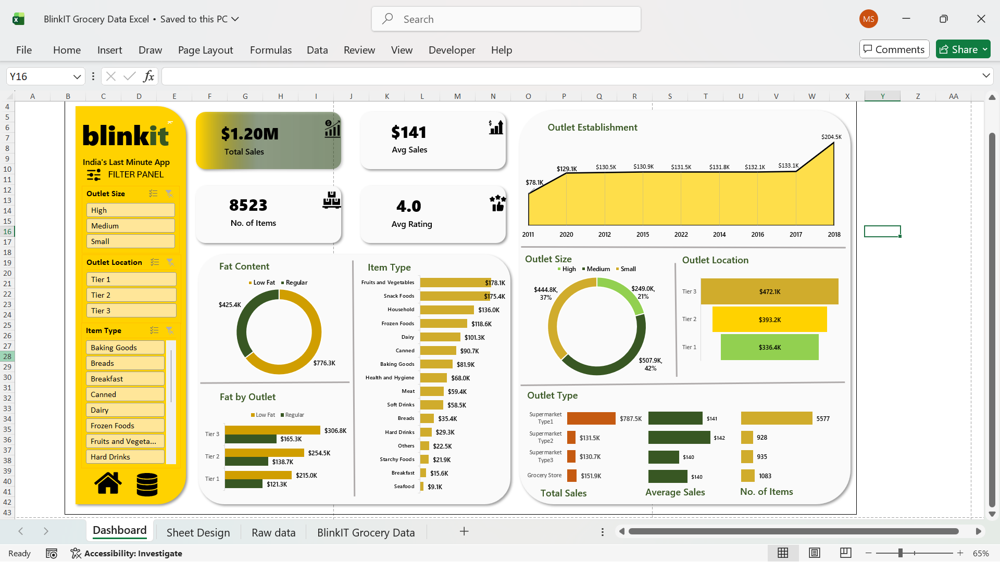

# blinkit-grocery-sales-dashboard-excel
Excel dashboard analyzing Blinkit grocery sales using KPIs, Pivot Tables, and slicers

## Project Overview

This project is an end-to-end Excel dashboard built to analyze grocery sales data inspired by Blinkit.
The dashboard provides a quick view of sales performance, outlet analysis, and product-level insights using interactive filters and KPIs.

## Tools & Skills Used

- Microsoft Excel
- Pivot Tables & Pivot Charts
- Slicers & Filters
- Excel formulas (SUMIFS, AVERAGEIFS, MAXIFS, UNIQUE, TRIM)
- Data cleaning and standardization
- Dashboard design and layout
  
## Key KPIs

- Total Sales: $1.20M
- Average Sales: $141
- Number of Items: 8,523
- Average Rating: 4.0

## Analysis Performed

- Sales trend analysis by outlet establishment year
- Comparison of sales by outlet size and outlet location
- Item type contribution to total sales
- Fat content distribution across outlets
- Outlet type performance based on total sales, average sales, and item count

## Key Business Insights

- Medium-sized outlets generate the highest share of total sales.
- Tier 3 outlet locations outperform Tier 1 locations in total revenue.
- Fruits & Vegetables and Snack Foods are the top-selling categories.
- Regular fat products contribute more to total sales compared to low-fat products.

## File Structure

The entire analysis is maintained in a single Excel workbook with logically separated sheets:

- Raw_Data: Original dataset with no modifications
- Data_Cleaning: Standardized categories and helper columns
- Pivot_Backend: Pivot tables used to power charts and KPIs
- Dashboard: Final interactive dashboard with slicers and visuals

## Dashboard Preview

## Outcome

This project strengthened my understanding of data cleaning, KPI design, and business storytelling
using Excel. It also demonstrates how Excel can be used to build structured, interactive dashboards
for decision-making.
